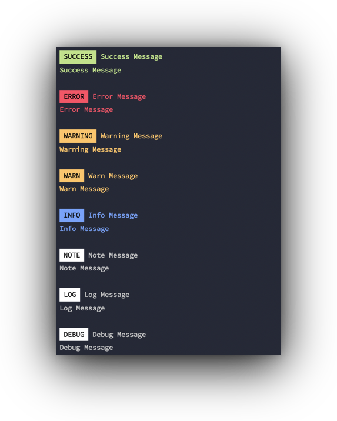
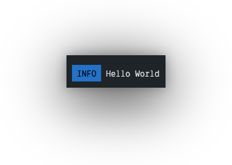

# @codedungeon/messenger

<h1 align="center">
    
</h1>

## Description

Messenger is a simple node module for displaying pretty console logs (with lots of formatting options) and support for logging messages to `.log` files (including daily rotation)

## Install

### npm

```bash
> npm install @codedungeon/messenger
```

### yarn

```bash
> yarn add @codedungeon/messenger
```

## Usage

Messenger provides a suite of methods which can be used to quickly display appropriately colored messages. Each method can be accessed from the _Messenger_ object, or destructured methods

```js
const Messenger = require('@codedungeon/messenger')
Messenger.success('All tests passed', 'SUCCESS')
```

or

```js
const {success} = require('@codedungeon/messenger')
success('All tests passed','SUCCESS)
```

The following demonstrates how each message can be displayed

```js
const msg = require('@codedungeon/messenger')
const pkgInfo = require('./package.json')
msg.initLogger(true, 'logs', pkgInfo.name)

console.log('')
let showIcons = false
let showLabels = false

msg.critical('critical message', showLabels ? 'CRITICAL' : '', showIcons)
msg.danger('critical message', showLabels ? 'DANGER' : '', showIcons)
msg.error('error message', showLabels ? 'ERROR' : '', showIcons)
msg.success('success message', showLabels ? 'SUCCESS' : '', showIcons)
msg.warning('warning message', showLabels ? 'WARNING' : '', showIcons)
msg.important('important message', showLabels ? 'IMPORTANT' : '', showIcons)
msg.warn('warn message', showLabels ? 'WARN' : '', showIcons)
msg.notice('notice message', showLabels ? 'NOTICE' : '', showIcons)
msg.note('note message', showLabels ? 'NOTE' : '', showIcons)
msg.status('status message', showLabels ? 'STATUS' : '', showIcons)
msg.info('info message', showLabels ? 'INFO' : '', showIcons)
msg.debug('debug message', showLabels ? 'DEBUG' : '', showIcons)
```

If you want to pass a standard JavaScript `object` or `array` Messenger will use the `dump` method to display message, and if you supply `label` parameter, it will be displayed first and then message will be displayed (see the `./examples/test-messenger-obj.js` example method for further information)

```js
let obj = { fname: 'Mike', lname: 'Erickson', kids: ['Joelle', 'Brady', 'Bailey', 'Trevor'] }
Messenger.success(obj, 'FAMILY')
```

### Using `alert` helper

You can also invoke any of the Messenger methods using the `alert` helper which accepts an object of options as opposed to passing the 3 separate parameters

Note: This method does **not** support calling statically

```js
type - default "info"
msg  - notification message
icon - default "false"

alert({ type: 'info', msg: 'hello world', icon: false })
print({ type: 'info', msg: 'hello world', icon: false })
```

```js
let msg = 'Hello World'
messenger.alert({ msg })
messenger.alert({ type: 'status', msg, label: '', icon: false })
messenger.alert({ type: 'status', msg, label: 'STATUS', icon: false })
messenger.alert({ type: 'status', msg, label: 'STATUS', icon: true })
```

### Using `print` helper (same options as `alert`)

Or, if you choose, you can use the `print` helper

```js
let msg = 'Hello World'
messenger.print({ type: 'success', msg })
messenger.print({ type: 'success', msg, label: 'SUCCESS', icon: false })
messenger.print({ type: 'success', msg, label: 'SUCCESS', icon: true })
```

### Messenger Labels

In addition to displaying a full message with labels, Messenger includes `label` methods which format the supplied text as label

You can build each of message label only, providing the ability to construct messages with mixed color and backgrounds. Each method can be access off the _Messenger_ object, or destructured.

```js
const Messenger = require('@codedungeon/messenger')
Messenger.lblInfo('INFO')
```

or

```js
const { lblInfo } = require('@codedungeon/messenger')
lblInfo('INFO')
```

<pre>
_lblDebug_(labelText: string)
_lblLog_(labelText: string)
_lblInfo_(labelText: string)
_lblStatus_(labelText: string)
_lblNotice_(labelText: string)
_lblNote_(labelText: string)
_lblError_(labelText: string)
_lblSuccess_(labelText: string)
_lblWarn_(labelText: string)
_lblWarning_(labelText: string)
_lblDanger_(labelText: string)
_lblImportant_(labelText: string)
</pre>

**Example**

```js
const m = require('@coddungeon/messenger')

console.log(`${m.lblInfo('INFO')} Hello World`)
```

will produce the following

<h1 align="left">
    
</h1>

### Logger

Messenger includes a simple logging interface which log all console logging to persisted log files

#### Logger Methods

_initLogger_(logToFile: boolean, path: string, name: string)
_writeToLog_(type: string, args: object, forceLogToFile: boolean)
_loggerCritical_(msg: string)
_loggerError_(msg: string)
_loggerStatus_(msg: string)
_loggerWarning_(msg: string)
_loggerWarn_(msg: string)
_loggerImportant_(msg: string)
_loggerInfo_(msg: string)
_loggerDebug_(msg: string)
_loggerLog_(msg: string)
_oggerStatus_(msg: string)
_loggerNotice_(msg: string)
_loggerNote_(msg: string)
_disableLog_()
_enableLog_()

#### Using `initLogger`

Using the `initLogger` method at the start of your CLI process, you can determine the location of log files

The following is the basic workflow for initializing Messneger Logger.

```js
// get package information to pass along logger name
let pkgInfo = require('./package.json')

const Messenger = require('../src/messenger')

// initialize logger, defining the directory where logs are stored
Messenger.initLogger(true, 'logs', pkgInfo.name)
```

#### Log Files

Logger will create a unique log file in the defined log directory (typically either `logs` or `system`), each day using the following syntax

```bash
<name>-yyyy-mm-dd.log
```

#### System Logger

In addition to defining the `logs` location, you can also use a reserved name `system` which will create log files using the operating system log directory

```js
...
Messenger.initLogger(true, 'system', pkgInfo.name)
...
```

This will create a single log file for defined `name`

##### Mac OS

```bash
<home>/System/Logs/<name>.log
```

##### Windows

[Windows Log File Locations](https://docs.microsoft.com/en-us/troubleshoot/windows-server/application-management/move-event-viewer-log-files#:~:text=By%20default%2C%20Event%20Viewer%20log,location%20of%20the%20log%20files.)

## License

Copyright &copy; 2019-2022 Mike Erickson
Released under the MIT license

## Credits

messenger written by Mike Erickson

E-Mail: [mike.erickson@codedungeon.io](mailto:mike.erickson@codedungeon.io)

Twitter: [@codedungeon](http://twitter.com/codedungeon)

Website: [codedungeon.io](http://codedungeon.io)
